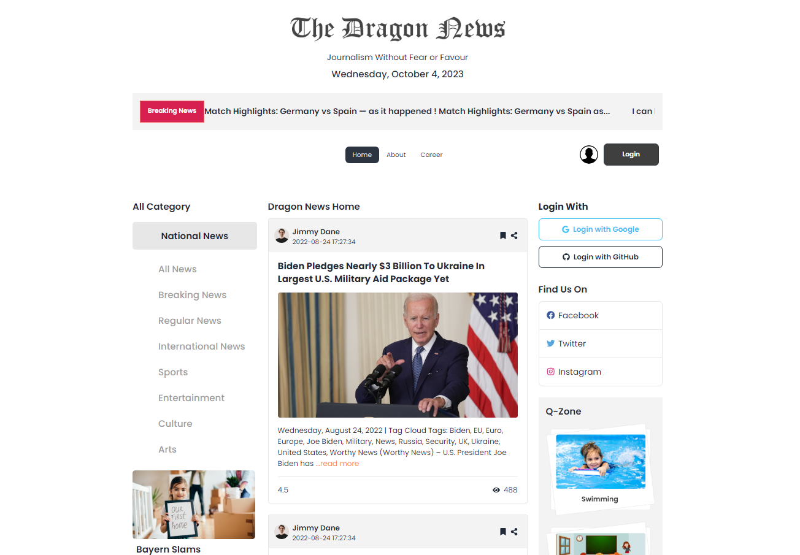

# Dragon News

A simple daily news portal website, built using React Router, Tailwind CSS, Daisy UI, and Firebase SDK for authentication.

### Technologies Used

### Features

- Browse the news Homepage which shows the date, Breaking News section, categories of news and headlines.
- Register and create account by providing your name, photo, email, and password.
- Login to the site using your email and password.
- Further login options using Google and GitHub.
- Click on a news card to view news details.

### Additional Libraries Used

- Moment.js
- React FAST Marquee

### Preview

### Live Site

[firebase-deploy](https://dragon-news-auth-7d46f.web.app/)
